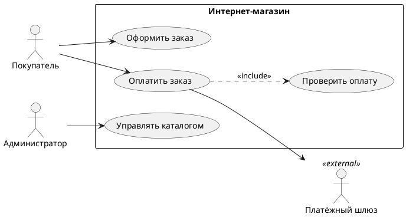
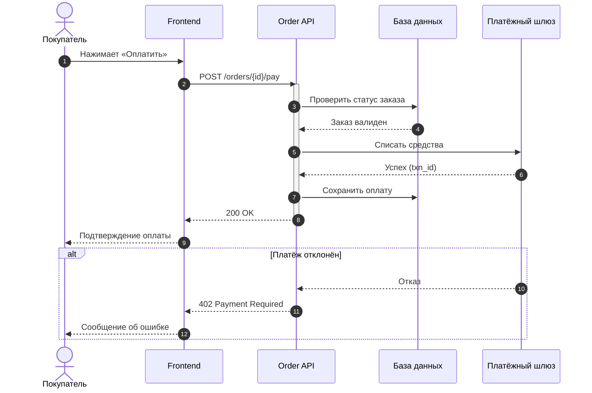
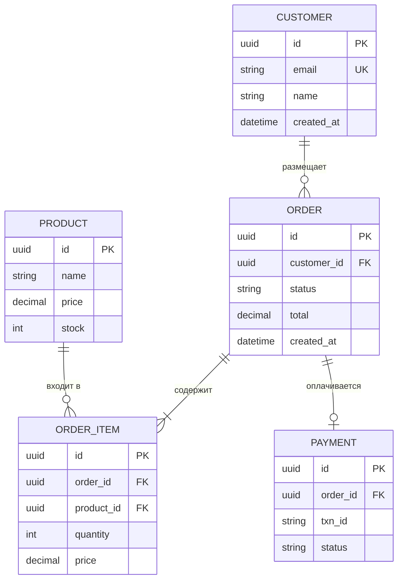
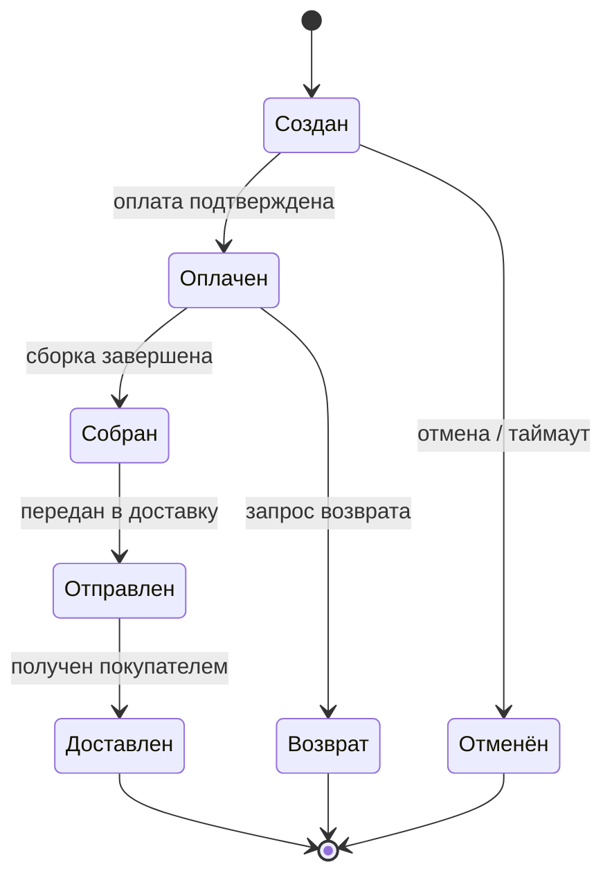
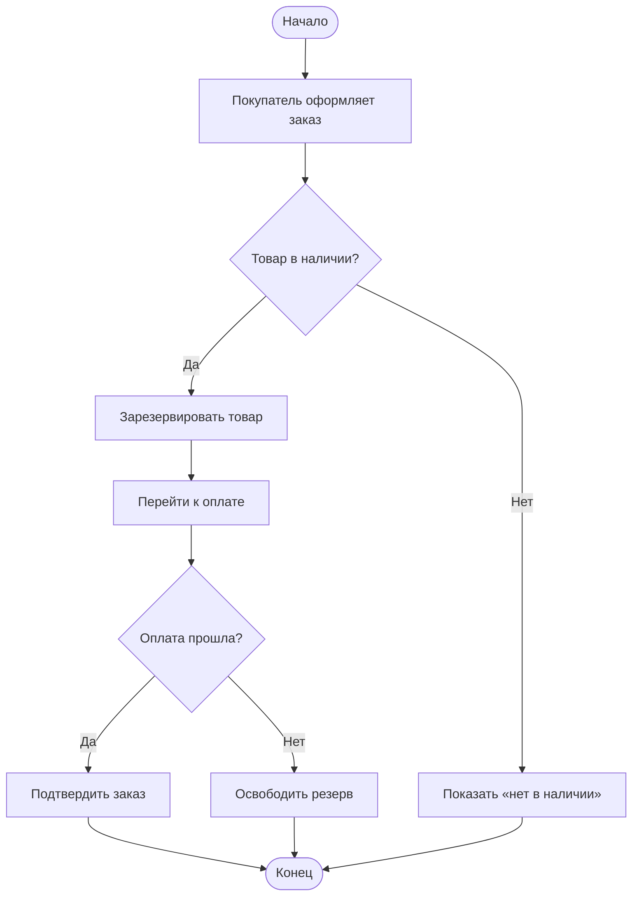
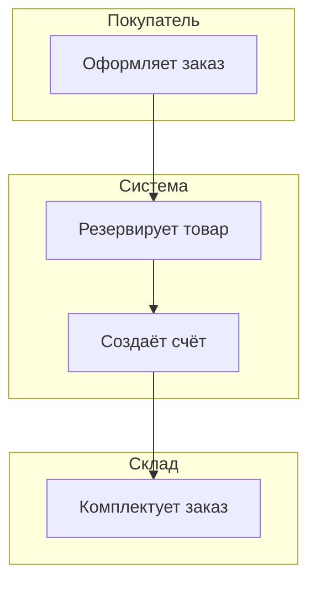
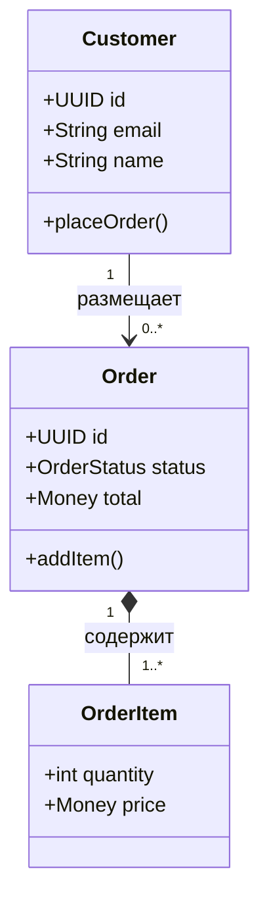
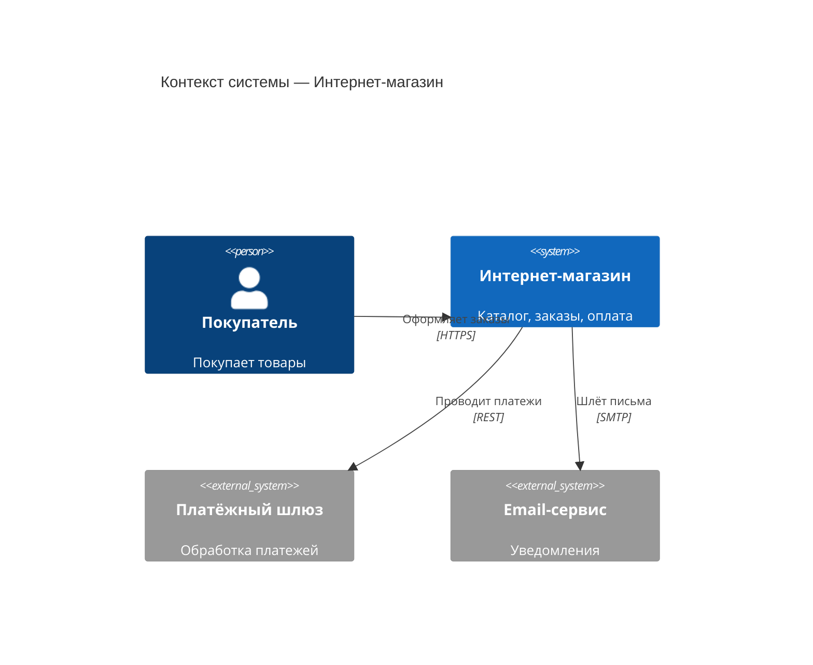
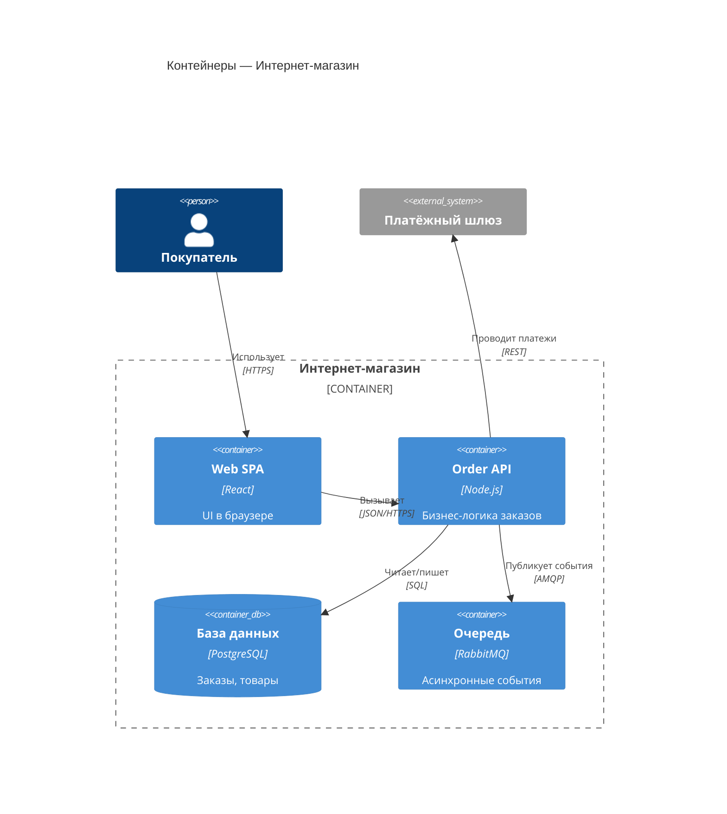
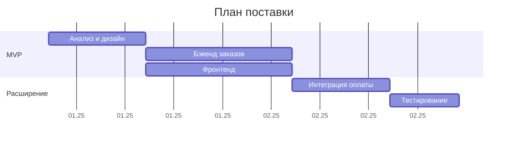

# Рецепты диаграмм (Mermaid + PlantUML)

Готовые рабочие шаблоны. Копируй и адаптируй под продукт. Сохраняй синтаксис точно —
неверный синтаксис не отрендерится.

Правило выбора нотации:
- **Mermaid** — по умолчанию (sequence, ER, state, activity/flowchart, class, gantt, C4).
- **PlantUML** — для **use case диаграмм** (у Mermaid нет нативной нотации) и там, где нужна
  строгая UML-семантика.

Если в окружении есть валидатор/рендер Mermaid (коннектор Mermaid Chart) — прогоняй через него
ключевые диаграммы и исправляй ошибки до сдачи.

---

## 1. Use case диаграмма — PlantUML

У Mermaid нет нативной use case нотации. Используй PlantUML:

````markdown

````

Связи: `-->` association, `..> : <<include>>`, `..> : <<extend>>`, `<|--` generalization.
`<<external>>` помечай внешних актёров-системы.

Если пользователю строго нужен Mermaid и use case можно показать упрощённо — допустим flowchart
с актёрами слева и овалами-юзкейсами, но честно отметь, что это аппроксимация, а не UML use case.

---

## 2. Sequence-диаграмма — Mermaid

````markdown

````

Стрелки: `->>` синхронный вызов, `-->>` ответ, `-)` асинхронный. Блоки: `alt/else/end`,
`opt/end`, `loop/end`, `par/and/end`. `Note over A,B: текст` для пояснений. `activate/deactivate`
показывают время жизни вызова.

---

## 3. ER-диаграмма — Mermaid

````markdown

````

Кардинальность: `||` ровно один, `o|` ноль или один, `}o` ноль или много, `}|` один или много.
Слева направо читается «<левая> <отношение> <правая>». PK/FK/UK помечают ключи.

---

## 4. State-диаграмма (жизненный цикл) — Mermaid

````markdown

````

`[*]` — начальное/конечное состояние. Переход: `Состояние1 --> Состояние2 : событие`.
Состояния должны совпадать со статусами сущности в модели данных (08).

---

## 5. Activity / бизнес-процесс — Mermaid flowchart

````markdown

````

Для процессов с зонами ответственности используй `subgraph` как дорожки (swimlanes):

````markdown

````

---

## 6. Class / доменная модель — Mermaid

````markdown

````

Связи: `-->` ассоциация, `*--` композиция, `o--` агрегация, `<|--` наследование,
`..>` зависимость. Кратность — в кавычках по краям.

---

## 7. Архитектура C4 — Mermaid (по умолчанию) или PlantUML (для строгого C4)

**C4 Context (Level 1) — Mermaid:**

````markdown

````

**C4 Container (Level 2) — Mermaid:**

````markdown

````

> Примечание: C4-диаграммы в Mermaid помечены как экспериментальные и иногда капризны с раскладкой.
> Если рендер ломается или нужна строгая C4-нотация — используй PlantUML с библиотекой C4-PlantUML.

**C4 Container — PlantUML (строгий вариант):**

````markdown
```plantuml
@startuml
!include https://raw.githubusercontent.com/plantuml-stdlib/C4-PlantUML/master/C4_Container.puml
Person(customer, "Покупатель")
System_Boundary(c1, "Интернет-магазин") {
  Container(spa, "Web SPA", "React")
  Container(api, "Order API", "Node.js")
  ContainerDb(db, "БД", "PostgreSQL")
}
System_Ext(payment, "Платёжный шлюз")
Rel(customer, spa, "Использует", "HTTPS")
Rel(spa, api, "Вызывает", "JSON/HTTPS")
Rel(api, db, "Читает/пишет", "SQL")
Rel(api, payment, "Платежи", "REST")
@enduml
```
````

---

## 8. Диаграмма Ганта (план поставки) — Mermaid

````markdown

````

Подчеркни, что Гант иллюстративный — оценки грубые, не обязательство по датам.

---

## Чек-лист перед сдачей диаграмм

- [ ] Тип нотации выбран по правилу (use case → PlantUML; остальное → Mermaid).
- [ ] Имена актёров/сущностей/сервисов согласованы со всеми остальными документами.
- [ ] Каждая диаграмма снабжена текстовым пояснением.
- [ ] Синтаксис проверен (по возможности — прогоном через рендер/валидатор).
- [ ] Sequence покрывает и happy path, и ошибки; state согласован с моделью данных.
