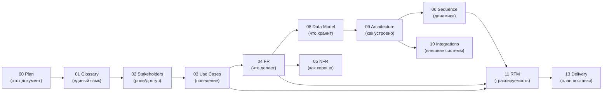

# Carsale — План анализа и проекта

> Версия: 1.0 · Дата: 2026-06-28 · Источник: [PRD](../PRD.md) · Автор: Системный аналитик

---

## 1. Краткое резюме

Carsale — веб-платформа для покупки и продажи автомобилей на рынке Узбекистана, дифференциатором которой является **доверие через данные**: каждое объявление сопровождается AI-оценкой справедливости цены (Deal Rating), ML-флагами возможного скрученного пробега и детекцией фрода. Цель — устранить информационную асимметрию, из-за которой покупатель б/у авто сегодня вынужден ехать смотреть машину вживую, не имея возможности оценить честность продавца дистанционно.

Главный конкурент — Avtoelon (Kolesa Group, ~2 млн MAU). Стратегия Carsale — не фронтальная атака, а захват нишевого сегмента «проверенных сделок»: верификация через OneID, ML-детекция аномалий, прозрачная история — функции, которых у лидера рынка нет.

Данный пакет аналитики охватывает **Фазу 0 (MVP)** в полном объёме и Фазу 1–2 на уровне требований и архитектурных решений. Целевой регион — Узбекистан, интерфейс — UZ + RU с первого дня.

---

## 2. Объём и подход

### Что входит в анализ
- Полный функциональный охват PRD v1.1: FR-01 — FR-20
- Нефункциональные требования: производительность, безопасность, соответствие ЗРУ-547
- Архитектура на уровне C4 Context + Container + Component для ключевых сервисов
- Поведенческий анализ: use case модель, sequence-диаграммы, жизненные циклы сущностей
- Модель данных: ER-диаграмма + словарь сущностей
- Интеграционные контракты: SMS, платежи, OneID, LLM API
- Матрица трассируемости: цель PRD → требование → use case → тест
- Риски, допущения, открытые вопросы
- План поставки с WBS и диаграммой Ганта

### Что вынесено за рамки
- Детальный OpenAPI-контракт (yaml/json) — следующий этап, после согласования API-дизайна
- Дизайн-система и UI-спецификация — отдельный артефакт дизайнера
- DevOps/Infrastructure-as-Code — отдельная задача DevOps-команды
- Детальные тест-кейсы (test cases) — выходят за рамки системного анализа; здесь — acceptance criteria

### Методология
| Слой | Стандарт/Подход |
|------|----------------|
| Требования | ISO/IEC/IEEE 29148:2018 |
| Use cases | Шаблон Cockburn (структурный) |
| Архитектура | C4 model + arc42 (облегчённый) |
| Диаграммы поведения | UML sequence, activity, state |
| Архитектурные решения | ADR (Architecture Decision Records) |
| Трассируемость | RTM (Requirements Traceability Matrix) |

### Ключевые допущения верхнего уровня
1. Технологический стек — модульный монолит на старте (подробнее: [ADR-006](14-adr/ADR-006-modular-monolith.md)), с возможностью разделения на сервисы.
2. Frontend — React/Next.js (SSR для SEO), Backend — Node.js / Python FastAPI.
3. База данных — PostgreSQL (основная) + Redis (кэш/сессии).
4. Хостинг — только юрисдикция Узбекистана: [ADR-004](14-adr/ADR-004-uz-hosting.md).
5. ML-модели разрабатываются и обслуживаются внутренней командой на Python.
6. Мобильное приложение не входит в MVP: [ADR-005](14-adr/ADR-005-web-first.md).

---

## 3. Состав пакета аналитики

| # | Файл | Описание |
|---|------|----------|
| 00 | [00-analysis-plan.md](00-analysis-plan.md) | **Этот документ.** Карта пакета, подход, дорожная карта. |
| 01 | [01-glossary-domain-model.md](01-glossary-domain-model.md) | Глоссарий единого языка + доменная модель + бизнес-правила. |
| 02 | [02-stakeholders-actors.md](02-stakeholders-actors.md) | Стейкхолдеры, актёры системы, роли и модель доступа, RACI. |
| 03 | [03-use-case-model.md](03-use-case-model.md) | Use case диаграмма + детальные спецификации по Cockburn. |
| 04 | [04-functional-requirements.md](04-functional-requirements.md) | SRS: функциональные требования FR-01 – FR-20, acceptance criteria. |
| 05 | [05-nonfunctional-requirements.md](05-nonfunctional-requirements.md) | NFR: производительность, безопасность, масштабируемость, соответствие ЗРУ-547. |
| 06 | [06-sequence-diagrams.md](06-sequence-diagrams.md) | Sequence-диаграммы ключевых сценариев (happy path + ошибки). |
| 07 | [07-process-and-state.md](07-process-and-state.md) | Бизнес-процессы (activity) + жизненные циклы сущностей (state). |
| 08 | [08-data-model.md](08-data-model.md) | ER-диаграмма + словарь сущностей и атрибутов. |
| 09 | [09-architecture.md](09-architecture.md) | Архитектура C4 (Context → Container → Component) в структуре arc42. |
| 10 | [10-integrations-api.md](10-integrations-api.md) | Внешние интеграции, контракты API (высокий уровень), sequence. |
| 11 | [11-traceability-matrix.md](11-traceability-matrix.md) | RTM: цель PRD → требование → use case → диаграмма → тест. |
| 12 | [12-risks-assumptions.md](12-risks-assumptions.md) | Реестр рисков, допущения, открытые вопросы. |
| 13 | [13-delivery-plan.md](13-delivery-plan.md) | WBS, фазы/майлстоуны, зависимости, грубые оценки, Гант. |
| 14 | [14-adr/](14-adr/) | Architecture Decision Records (ADR-001 – ADR-006). |

---

## 4. Дорожная карта анализа → разработки

**Принцип:** сначала язык и роли, затем поведение (use case), затем требования, затем данные и архитектура. Только после этого — план поставки.

### Связь с фазами разработки

| Фаза разработки | Необходимые артефакты |
|----------------|----------------------|
| **Sprint 0 (Architecture)** | 01, 02, 05, 08, 09, ADR |
| **Фаза 0 MVP** | 03 (UC P0), 04 (FR-01–11), 06 (key sequences), 10 |
| **Фаза 1 Expansion** | 03 (UC P1), 04 (FR-12–17), обновление 08, 10 |
| **Фаза 2 Maturity** | 03 (UC P2), 04 (FR-18–20), обновление 09 |

---

## 5. Открытые вопросы верхнего уровня

| # | Вопрос | Почему критично | Кто отвечает | Блокирует |
|---|--------|----------------|--------------|-----------|
| OQ-1 | Какая юридическая форма ООО/АО зарегистрирована в UZ? | Нужна для регистрации оператора ПД и договоров с Eskiz/Click | Бизнес | MVP-запуск |
| OQ-2 | Финальный выбор платёжного шлюза: Click **или** Payme **или** оба? | Влияет на FR-10 и интеграционный контракт | PM + Бизнес | FR-10 |
| OQ-3 | Команда ML: инхаус или подрядчик? Размер датасета к старту? | Влияет на план поставки FR-03, FR-05, FR-06, FR-07 | CTO | 13 (план) |
| OQ-4 | Статус переговоров с OneID (gov.uz) о партнёрстве? | FR-02 (верификация через OneID) | Бизнес / BD | FR-02 |
| OQ-5 | Предпочтительная облачная инфраструктура UZ (Beeline/Ucell/собственный сервер)? | Влияет на ADR-004 и план деплоя | CTO | 09 (архитектура) |
