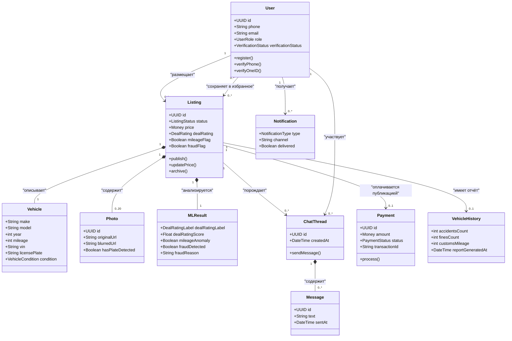

# Carsale — Глоссарий и доменная модель

> Версия: 1.0 · Дата: 2026-06-28 · Источник: [PRD](../PRD.md) · Автор: Системный аналитик

---

## 1. Глоссарий (единый язык / ubiquitous language)

Все команды — разработка, продукт, аналитика, QA — используют именно эти определения. При расхождении — этот документ приоритетнее любого другого.

| Термин | Определение | Синонимы | Примечание |
|--------|-------------|----------|------------|
| **Объявление** (Listing) | Публичная запись о продаже конкретного автомобиля: характеристики, фото, цена, статус, ML-флаги | Лот, объявление о продаже | Центральная сущность платформы |
| **Deal Rating** | ML-метка справедливости цены объявления: «Отличная сделка», «Честная цена» или «Завышенная цена». Вычисляется сравнением с аналогами (марка/модель/год/пробег/регион) | AI-оценка, ценовой рейтинг | Отображается в каталоге и на карточке; обновляется при изменении цены продавцом |
| **Флаг пробега** (Mileage Flag) | ML-предупреждение «⚠ Пробег требует проверки» — аномалия между заявленным пробегом и историческими данными (год выпуска, предыдущие объявления, данные таможни) | Скрученный пробег, откат пробега | Видим покупателю на карточке; false positive rate < 5% |
| **Фрод-флаг** (Fraud Flag) | Сигнал автоматической детекции мошенничества: дубль фото (image hash), аномально низкая цена (< 40% рынка) | Сигнал фрода, скам-флаг | Автоматически скрывает объявление до проверки модератором |
| **Верификация** | Подтверждение личности продавца: базовая — SMS OTP; расширенная — через OneID (национальная ID-система UZ) | Проверка продавца | Верифицированный продавец получает бейдж «Проверен» и приоритет в выдаче |
| **OneID** | Государственная система цифровой идентификации личности в Узбекистане (gov.uz). Позволяет подтвердить паспортные данные онлайн | Национальный ID, ЕСИА (аналог в РФ) | P1 функция; требует регистрации Carsale как партнёра |
| **Покупатель** (Buyer) | Зарегистрированный или анонимный пользователь, ищущий автомобиль для покупки | Клиент | Видит Deal Rating, ML-флаги, использует чат |
| **Продавец** (Seller) | Зарегистрированный пользователь, публикующий объявления о продаже. Может быть частником или дилером | Владелец объявления | Размещает объявления, получает AI-оценку цены, общается с покупателями |
| **Дилер** (Dealer) | Юридическое лицо — автосалон с портфелем 5–100+ автомобилей | Автосалон, официальный дилер | P2 фича — отдельный кабинет дилера (FR-19) |
| **Гость** (Guest) | Неаутентифицированный посетитель платформы | Анонимный пользователь | Может просматривать каталог и карточки, но не инициировать чат или размещение |
| **Администратор** (Admin) | Сотрудник Carsale с доступом к панели модерации: проверяет фрод-флаги, управляет пользователями, видит аналитику платформы | Модератор | Внутренняя роль |
| **Карточка авто** (Listing Page) | Детальная страница объявления: галерея фото, характеристики, Deal Rating, ML-флаги, история, кнопка «Написать» | Страница объявления | Реализует FR-08 |
| **Seed-датасет** | Искусственно сгенерированный обучающий датасет для ML-моделей до накопления реальных данных платформы | Синтетический датасет | Подробнее: ADR-003 |
| **OTP** | One-Time Password — одноразовый код, доставляемый по SMS для верификации номера телефона | СМС-код, код подтверждения | Доставляется через Eskiz UZ |
| **PII** | Personally Identifiable Information — персональные данные пользователя (телефон, email, паспортные данные) | Персональные данные | Хранятся в соответствии с ЗРУ-547 |
| **ЗРУ-547** | Закон Республики Узбекистан «О персональных данных» №ЗРУ-547 от 02.07.2019 | Закон о персональных данных | Требует хостинга PII в юрисдикции UZ |
| **VIN** | Vehicle Identification Number — уникальный 17-символьный идентификатор автомобиля | Вин-номер, идентификационный номер | Хранится внутри платформы, не публикуется в объявлении |
| **Госномер** | Государственный регистрационный знак автомобиля | Номерной знак | Замазывается на фото (FR-03); хранится внутри платформы |
| **ГУБДД** | Главное управление безопасности дорожного движения МВД Узбекистана — источник данных о ДТП и штрафах для FR-12 | Дорожная полиция | B2G-интеграция, Фаза 1, критический путь |
| **Click / Payme** | Узбекские платёжные шлюзы для приёма онлайн-платежей | Платёжная система | Выбраны для FR-10; данные карт не хранятся на платформе (PCI DSS через шлюз) |
| **Eskiz UZ** | Узбекский SMS-шлюз для отправки OTP и уведомлений | SMS-провайдер | Выбран для FR-01; ADR-001 |
| **Deal Rating Score** | Числовой скор (внутренний), на основе которого присваивается Deal Rating метка | Ценовой скор ML | Не публикуется напрямую; используется для сортировки «сначала выгодные» |
| **Image Hash** | Перцептивный хеш изображения для детекции дублей фото между объявлениями | Перцептивный хеш | Используется в FR-07 (детекция фрода) |
| **Блюр** (Blur) | Автоматическое размытие госномера и VIN на фото с помощью CV-модели | Маскировка, замазывание | FR-03; продавец видит превью с блюром до сохранения |
| **Избранное** (Favorites) | Список объявлений, сохранённых покупателем для отслеживания | Закладки, wishlist | FR-13 (P1) |
| **Алерт снижения цены** | Push/email уведомление покупателю при снижении цены на сохранённое объявление на ≥ 3% | Price drop alert | FR-13 (P1) |
| **NLP-поиск** | Поиск по каталогу на естественном языке: «надёжный семейный авто до $10 000 с автоматом» | Семантический поиск | FR-15 (P1); требует LLM API |
| **Расширенный отчёт** | Платный документ об истории конкретного авто: ДТП, штрафы, данные таможни (пробег на растаможке) | История авто, Vehicle Report | FR-12 (P1); зависит от B2G-партнёрства |

---

## 2. Доменная модель

Концептуальная структура домена. Не физическая схема БД — она в [08-data-model.md](08-data-model.md).

**Участники модели:**
- **User** — унифицированный аккаунт; роль (Buyer / Seller / Admin) определяет доступные действия.
- **Listing** — центральная сущность; агрегирует Vehicle, Photo, MLResult, ChatThread, Payment.
- **Vehicle** — данные об автомобиле; VIN и госномер хранятся внутри, не публикуются.
- **MLResult** — результаты всех ML-моделей для конкретного объявления.
- **ChatThread / Message** — внутренний чат; телефон не раскрывается без согласия.
- **VehicleHistory** — платный расширенный отчёт (P1, зависит от B2G).

---

## 3. Бизнес-правила

| ID | Правило | Источник |
|----|---------|---------|
| BR-1 | Незарегистрированный пользователь (Гость) **не может** размещать объявления или инициировать чат | FR-01, FR-09 |
| BR-2 | Каждое объявление **должно** пройти проверку на фрод (FR-07) до публикации; объявления с фрод-флагом скрываются автоматически | FR-07 |
| BR-3 | VIN и госномер **никогда не публикуются** в открытом виде на карточке объявления | 6.2 PRD |
| BR-4 | На публикуемых фото допускается **только версия с блюром** номеров; оригинал недоступен покупателям | FR-03 |
| BR-5 | Deal Rating **обязан быть присвоен** каждому активному объявлению; объявление без Deal Rating не переходит в статус «Опубликовано» | FR-05 |
| BR-6 | Данные карт **не хранятся** на платформе Carsale; приём платежей — только через сертифицированный PCI DSS шлюз (Click / Payme) | FR-10, NFR-10 |
| BR-7 | PII пользователей хранится **только на серверах в юрисдикции Узбекистана** (ЗРУ-547, ст. 8) | NFR-11 |
| BR-8 | При отправке запросов к внешним LLM API (Claude / OpenAI) данные объявлений **обезличиваются** — PII (телефон, email) не передаётся | 7.2 PRD |
| BR-9 | При снижении цены на ≥ 3% на сохранённое объявление система **должна** отправить алерт покупателю в течение 1 часа | FR-13 |
| BR-10 | Повторное объявление с тем же VIN или госномером с **меньшим** пробегом автоматически получает Флаг пробега | FR-06 |
| BR-11 | Цена объявления < 40% рыночной медианы для данной модели → фрод-флаг «too good to be true» + ручная модерация | FR-07 |
| BR-12 | Модерации требуют **только** объявления с ML-фрод-флагами; ручная проверка каждого объявления не применяется | 10.2 PRD |
| BR-13 | Кнопка «Написать» доступна **только зарегистрированным** пользователям (покупатель должен войти) | FR-08, FR-09 |
| BR-14 | Пользователь вправе удалить аккаунт и все связанные данные; запрос обрабатывается ≤ 15 рабочих дней | ЗРУ-547, ст. 19–22 |
