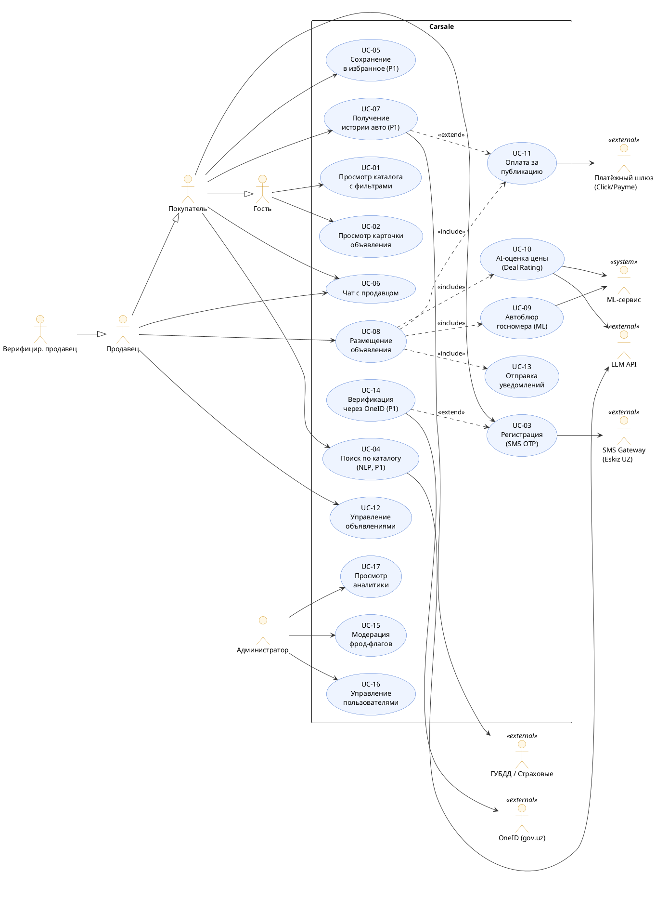

# Carsale — Use Case модель

> Версия: 1.0 · Дата: 2026-06-28 · Источник: [PRD](../PRD.md) · Автор: Системный аналитик

---

## 1. Диаграмма use cases

Use case диаграмма показывает всех актёров, границу системы Carsale и связи между ними.
Актёры согласованы с [02-stakeholders-actors.md](02-stakeholders-actors.md).

**Пояснение:** Покупатель наследует возможности Гостя, Продавец — возможности Покупателя, Верифицированный продавец — Продавца. Use cases P1 помечены отдельно; в MVP реализуются P0 (UC-01 – UC-13 без UC-04, UC-05, UC-07, UC-14).

---

## 2. Реестр use cases

| ID | Название | Основной актёр | Приоритет | Цели PRD |
|----|---------|----------------|-----------|---------|
| UC-01 | Просмотр каталога с фильтрами | Гость | P0 | G-3, G-4 |
| UC-02 | Просмотр карточки объявления | Гость | P0 | G-3, G-6 |
| UC-03 | Регистрация по телефону (SMS OTP) | Гость | P0 | G-5 |
| UC-04 | NLP-поиск по каталогу | Покупатель | P1 | G-3 |
| UC-05 | Сохранение в избранное и алерты цены | Покупатель | P1 | G-3 |
| UC-06 | Чат с продавцом / покупателем | Покупатель, Продавец | P0 | G-3, G-6 |
| UC-07 | Получение расширенного отчёта (история авто) | Покупатель | P1 | G-6 |
| UC-08 | Размещение объявления | Продавец | P0 | G-1, G-3, G-5 |
| UC-09 | Автоблюр госномера на фото | ML-сервис (in UC-08) | P0 | G-6 |
| UC-10 | AI-оценка цены (Deal Rating) | ML-сервис (in UC-08) | P0 | G-4, G-6 |
| UC-11 | Оплата за публикацию / отчёт | Продавец / Покупатель | P0 | G-2 |
| UC-12 | Управление своими объявлениями | Продавец | P0 | G-3 |
| UC-13 | Отправка уведомлений | Система (Scheduler) | P0 | G-3 |
| UC-14 | Верификация через OneID | Продавец | P1 | G-5 |
| UC-15 | Модерация фрод-флагов | Администратор | P0 | G-6 |
| UC-16 | Управление пользователями | Администратор | P0 | G-6 |
| UC-17 | Просмотр аналитики платформы | Администратор | P0 | G-1 |

---

## 3. Детальные спецификации (P0 use cases)

---

### UC-03: Регистрация по телефону (SMS OTP)

- **ID:** UC-03
- **Основной актёр:** Гость
- **Заинтересованные стороны и интересы:**
  - Гость: создать аккаунт быстро, без паролей
  - Платформа: получить верифицированный номер телефона для идентификации
  - Eskiz UZ: корректный запрос к API
- **Уровень:** пользовательская цель
- **Триггер:** пользователь нажимает «Войти / Зарегистрироваться»
- **Предусловия:** нет (доступно Гостю)
- **Постусловия (гарантии успеха):** аккаунт создан или найден, сессия установлена, номер телефона подтверждён
- **Связанные требования:** FR-01 · **Цели PRD:** G-5

**Основной поток (happy path):**
1. Гость вводит номер телефона (+998xxxxxxxxx)
2. Система валидирует формат номера
3. Система отправляет запрос к Eskiz UZ API: SMS с 6-значным OTP
4. Eskiz UZ доставляет SMS пользователю
5. Гость вводит OTP в форму на сайте
6. Система проверяет OTP (срок действия 5 мин, одноразовый)
7. Если аккаунт не существует — система создаёт новый (роль: Продавец при первом объявлении / Покупатель по умолчанию)
8. Система устанавливает сессию и перенаправляет на предыдущую страницу или профиль

**Альтернативные потоки:**
- 1a. Номер уже зарегистрирован: система отправляет OTP для входа в существующий аккаунт (не дублирует)
- 6a. Неверный OTP: система показывает ошибку «Неверный код», разрешает повторно ввести (до 3 попыток)
- 6b. OTP истёк: система предлагает запросить новый код

**Исключения / ошибки:**
- 2b. Неверный формат номера: система показывает inline-ошибку, не отправляет SMS
- 3b. Eskiz UZ недоступен: система показывает «Не удалось отправить SMS, попробуйте позже»; retry через 60 сек
- 6c. 3 неверных попытки: сессия OTP блокируется на 15 мин

**Частота / нагрузка:** 100–500 регистраций/входов в сутки (MVP); пиковая нагрузка утром и в выходные

---

### UC-08: Размещение объявления

- **ID:** UC-08
- **Основной актёр:** Продавец
- **Заинтересованные стороны и интересы:**
  - Продавец: быстро разместить объявление, узнать справедливую цену, привлечь покупателей
  - Покупатель: получить объявление с честными данными и Deal Rating
  - ML-сервис: получить данные для вычисления Deal Rating и блюра
  - Платёжный шлюз: провести оплату за публикацию
- **Уровень:** пользовательская цель
- **Триггер:** Продавец нажимает «Продать авто»
- **Предусловия:** Продавец аутентифицирован (UC-03 выполнен)
- **Постусловия:** объявление опубликовано (или отправлено на модерацию); Deal Rating присвоен; продавец уведомлён
- **Связанные требования:** FR-02, FR-03, FR-05, FR-07, FR-10, FR-11 · **Цели PRD:** G-1, G-3, G-5

**Основной поток (happy path):**
1. Продавец заполняет форму: марка, модель, год, пробег, состояние, цвет, КПП, привод, двигатель, цена, описание, город
2. Система валидирует обязательные поля
3. Продавец загружает фото (до 20 штук)
4. **[include UC-09]** ML-сервис детектирует и замазывает госномер/VIN на каждом фото; продавец видит превью с блюром
5. Продавец подтверждает фото и нажимает «Получить оценку»
6. **[include UC-10]** ML-сервис вычисляет Deal Rating и возвращает рекомендованный ценовой диапазон
7. Система отображает продавцу: его цена vs рекомендованный диапазон
8. Продавец корректирует цену (опционально) и нажимает «Опубликовать»
9. **[include UC-11]** Система предлагает оплату за публикацию (Фаза 1; в MVP — бесплатно)
10. **[include FR-07]** ML-сервис проверяет фото на дубли и цену на аномалии
    - Если фрод-флаг: объявление скрывается, уходит на модерацию (UC-15); продавец уведомляется
    - Если чисто: объявление публикуется
11. **[include UC-13]** Система отправляет продавцу уведомление «Ваше объявление опубликовано»

**Альтернативные потоки:**
- 4a. Госномер не детектирован автоматически: продавец вручную отмечает область блюра
- 6a. Недостаточно данных для Deal Rating: система показывает «Оценка недоступна» — объявление публикуется без метки
- 10a. Фрод-флаг (дубль фото): «Подобное фото уже используется в другом объявлении» → на модерацию
- 10b. Цена < 40% рынка: «Ваша цена значительно ниже рыночной» → на модерацию

**Исключения / ошибки:**
- 2b. Обязательные поля не заполнены: inline-ошибки, форма не отправляется
- 3b. Файл слишком большой (> 10 МБ) или неверный формат: ошибка при загрузке
- 4b. ML-блюр-сервис недоступен: предупреждение «Автоблюр временно недоступен»; продавец обязан замазать вручную или отложить
- 9b. Оплата не прошла: объявление не публикуется, сохраняется как «Черновик»

**Частота / нагрузка:** 50–200 новых объявлений в сутки (MVP); пик — выходные

---

### UC-06: Чат продавец ↔ покупатель

- **ID:** UC-06
- **Основной актёр:** Покупатель (инициирует), Продавец (отвечает)
- **Заинтересованные стороны и интересы:**
  - Покупатель: задать вопросы, не раскрывая свой телефон незнакомцу
  - Продавец: получать запросы от серьёзных покупателей
  - Платформа: сохранить взаимодействие внутри платформы (против дезинтермедиации)
- **Уровень:** пользовательская цель
- **Триггер:** Покупатель нажимает «Написать» на карточке объявления
- **Предусловия:** Покупатель аутентифицирован; объявление активно
- **Постусловия:** создан чат-тред между покупателем и продавцом; сообщение доставлено; продавец уведомлён
- **Связанные требования:** FR-09, FR-11 · **Цели PRD:** G-3, G-6

**Основной поток:**
1. Покупатель нажимает «Написать» → система проверяет аутентификацию
2. Если тред уже существует (покупатель ранее писал этому продавцу по этому объявлению) — открывает существующий
3. Если нет — создаёт новый ChatThread между buyer.id и seller.id для listing.id
4. Покупатель вводит и отправляет сообщение
5. Система сохраняет Message с timestamp
6. Система отправляет push/email уведомление продавцу «Новое сообщение по объявлению X»
7. Продавец открывает чат (в браузере или по ссылке из уведомления) и отвечает
8. Покупатель получает push/email с ответом

**Альтернативные потоки:**
- 1a. Покупатель не аутентифицирован: «Войдите, чтобы написать продавцу» → редирект на UC-03

**Исключения / ошибки:**
- 5b. Сеть недоступна: сообщение ставится в очередь на клиенте, отправляется при восстановлении
- 6b. Push-сервис недоступен: резервная отправка email

**Частота / нагрузка:** 3–10 сообщений на объявление за период продажи

---

### UC-10: AI-оценка цены (Deal Rating)

- **ID:** UC-10
- **Основной актёр:** ML-сервис (внутренний актёр, вызывается системой)
- **Заинтересованные стороны и интересы:**
  - Продавец: получить рекомендованный диапазон цен до публикации
  - Покупатель: видеть объективную метку справедливости цены
  - Платформа: 100% объявлений с Deal Rating; MAPE ≤ 15%
- **Уровень:** подфункция (вызывается из UC-08)
- **Триггер:** заполнена форма объявления с характеристиками авто и ценой
- **Предусловия:** марка, модель, год, пробег, регион указаны
- **Постусловия:** Deal Rating присвоен («Отличная сделка» / «Честная цена» / «Завышенная цена»); рекомендованный диапазон возвращён продавцу
- **Связанные требования:** FR-05 · **Цели PRD:** G-4, G-6

**Основной поток:**
1. Система вызывает ML-сервис с параметрами: марка, модель, год, пробег, состояние, регион, цена
2. ML-модель (градиентный бустинг) вычисляет медианную рыночную цену по аналогам из БД
3. ML-модель вычисляет отклонение цены продавца от медианы
4. Система присваивает метку:
   - цена ≤ медиана × 0.9 → «Отличная сделка» (зелёный)
   - медиана × 0.9 < цена ≤ медиана × 1.1 → «Честная цена» (серый)
   - цена > медиана × 1.1 → «Завышенная цена» (красный)
5. Система возвращает: DealRatingLabel, DealRatingScore, recommendedPriceMin, recommendedPriceMax
6. Продавцу показан рекомендованный диапазон; покупателю — только метка
7. При изменении цены продавцом — система пересчитывает Deal Rating (шаги 1–6)

**Альтернативные потоки:**
- 2a. Аналогов < 5 в БД: модель использует более широкий диапазон (год ±2, пробег ×2); если всё равно недостаточно — метка не присваивается
- 2b. Seed-датасет используется до накопления реальных данных: первые месяцы работы платформы

**Исключения / ошибки:**
- 1b. ML-сервис недоступен (таймаут > 1 сек): объявление публикуется без Deal Rating с меткой «Оценка недоступна»; фоновый job повторяет через 5 мин

---

### UC-15: Модерация фрод-флагов

- **ID:** UC-15
- **Основной актёр:** Администратор
- **Заинтересованные стороны и интересы:**
  - Покупатель: не видеть мошеннические объявления
  - Продавец: получить решение по своему объявлению быстро
  - Платформа: доля фрод-объявлений, ставших видимыми < 0.5%
- **Уровень:** пользовательская цель
- **Триггер:** ML-сервис сгенерировал FraudFlag; объявление автоматически скрыто
- **Предусловия:** объявление имеет статус «На модерации» (fraud_flag = true)
- **Постусловия:** объявление либо опубликовано (флаг снят), либо отклонено с причиной
- **Связанные требования:** FR-07 · **Цели PRD:** G-6

**Основной поток:**
1. ML-сервис детектирует дубль фото или аномально низкую цену → выставляет fraud_flag, статус «На модерации»
2. Администратор видит в панели модерации очередь «На проверке» (сортировка: сначала старые)
3. Администратор открывает объявление, видит:
   - Причину флага (дубль фото: ссылка на оригинал; низкая цена: % отклонения)
   - Профиль продавца (история, статус верификации)
4. Администратор принимает решение:
   - «Опубликовать» → статус «Опубликовано», флаг снят
   - «Отклонить» → статус «Отклонено», продавец получает уведомление с причиной

**Исключения:**
- 3a. Продавец запросил объяснение через чат-поддержку → администратор видит комментарий к тикету

**Частота:** 5–20 объявлений на модерации в сутки (MVP-оценка)

---

### UC-02: Просмотр карточки объявления

- **ID:** UC-02
- **Основной актёр:** Гость (и любой аутентифицированный пользователь)
- **Уровень:** пользовательская цель
- **Триггер:** пользователь кликает по объявлению в каталоге
- **Предусловия:** объявление активно (статус «Опубликовано»)
- **Постусловия:** пользователь видит полные данные об авто, Deal Rating, ML-флаги; зарегистрированный — кнопку «Написать»
- **Связанные требования:** FR-08 · **Цели PRD:** G-3, G-6

**Основной поток:**
1. Система загружает данные объявления из БД (< 2 сек)
2. Система загружает ML-результаты (Deal Rating, Mileage Flag) — вместе с карточкой, не после
3. Система рендерит страницу: фотогалерея (блюр-версии), характеристики, цена, Deal Rating (цветовой индикатор + текст), флаги (с tooltip-пояснением), описание, статус продавца
4. Если Mileage Flag: показывает «⚠ Пробег требует проверки» с пояснением
5. Если Fraud Flag виден публично: не показывается (объявление всё равно скрыто)
6. Зарегистрированный пользователь видит кнопку «Написать»; Гость — «Войдите, чтобы написать»
7. Трекинг события `listing_viewed`

**Частота:** наиболее часто используемый UC; 10 000–100 000 просмотров/сутки

---

### UC-01: Просмотр каталога с фильтрами

- **ID:** UC-01
- **Основной актёр:** Гость
- **Уровень:** пользовательская цель
- **Триггер:** пользователь открывает главную или раздел «Каталог»
- **Предусловия:** нет
- **Постусловия:** список объявлений отображён с применёнными фильтрами
- **Связанные требования:** FR-04 · **Цели PRD:** G-3

**Основной поток:**
1. Пользователь открывает каталог; система загружает объявления (по умолчанию: новые, Ташкент)
2. Пользователь задаёт фильтры (марка, модель, год, цена, пробег, КПП, привод, Deal Rating, город, «Проверен»)
3. Система применяет фильтры без перезагрузки страницы (< 2 сек)
4. Каждая карточка в ленте показывает: фото, марка/модель/год, цену, пробег, Deal Rating-метку, бейдж «Проверен»
5. Пользователь выбирает сортировку: дата / цена / Deal Rating («сначала выгодные»)
6. Пользователь кликает по объявлению → UC-02

**Альтернативные потоки:**
- 3a. Результаты не найдены: система показывает блок «Похожие объявления» (расширенный поиск без одного из фильтров)

**Трекинг:** `search_performed`, `filter_applied`, `listing_viewed`

---

### UC-11: Оплата за публикацию / отчёт

- **ID:** UC-11
- **Основной актёр:** Продавец (публикация) или Покупатель (отчёт)
- **Уровень:** пользовательская цель
- **Триггер:** пользователь инициирует платное действие
- **Предусловия:** аутентифицирован; платное действие готово к совершению
- **Постусловия:** оплата подтверждена; действие выполнено; квитанция на email
- **Связанные требования:** FR-10 · **Цели PRD:** G-2

**Основной поток:**
1. Система показывает стоимость действия (публикация / отчёт)
2. Пользователь выбирает способ оплаты (Click / Payme)
3. Система создаёт платёжный ордер в шлюзе, получает redirect URL
4. Пользователь перенаправляется на страницу шлюза
5. Пользователь вводит данные карты на странице шлюза (PCI DSS compliant; данные не проходят через Carsale)
6. Шлюз обрабатывает платёж, возвращает webhook с результатом
7. Система обновляет статус Payment → «Успешно»
8. Система выполняет действие (публикует объявление / возвращает отчёт)
9. Система отправляет квитанцию на email

**Альтернативные потоки:**
- 6a. Платёж отклонён (недостаточно средств, ошибка карты): шлюз возвращает статус отказа
- 6a (продолжение): система показывает понятное сообщение, предлагает повторить или выбрать другой шлюз

**Исключения:**
- 6b. Webhook не получен в течение 5 мин: система запрашивает статус через polling (3 раза с интервалом 1 мин)
