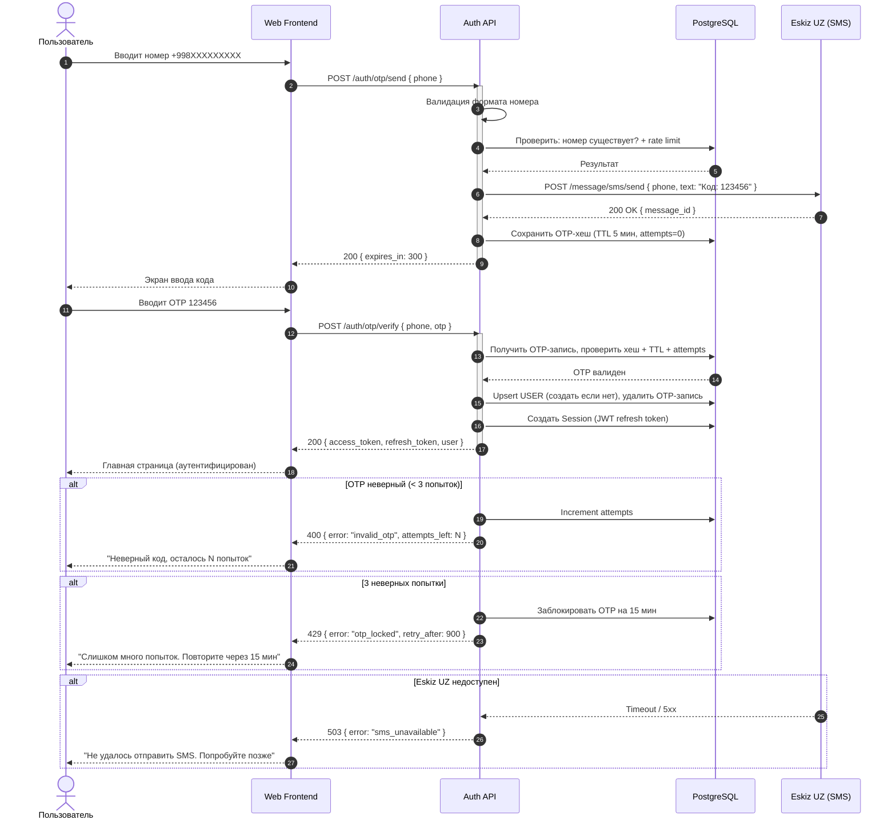
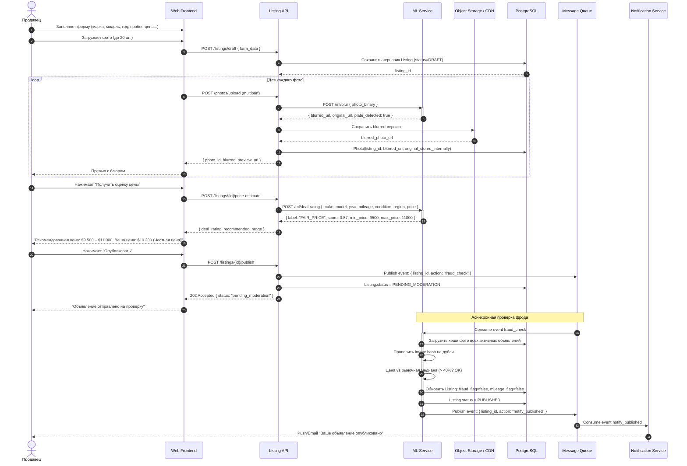
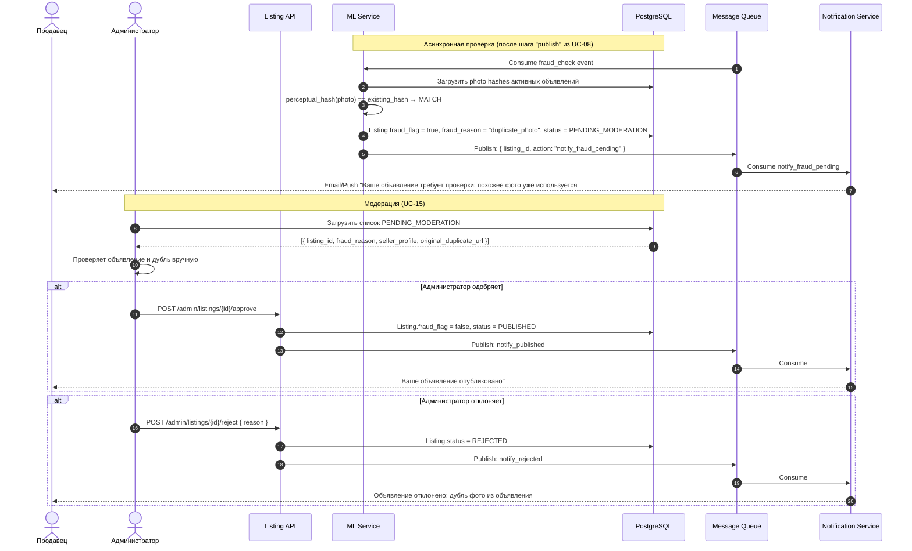
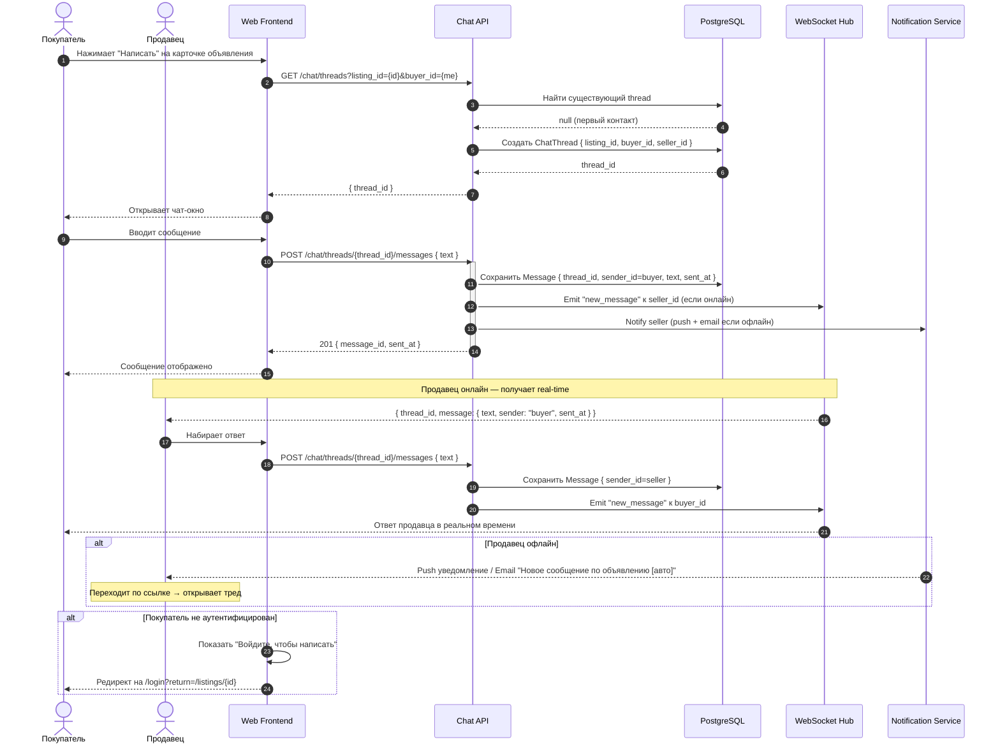
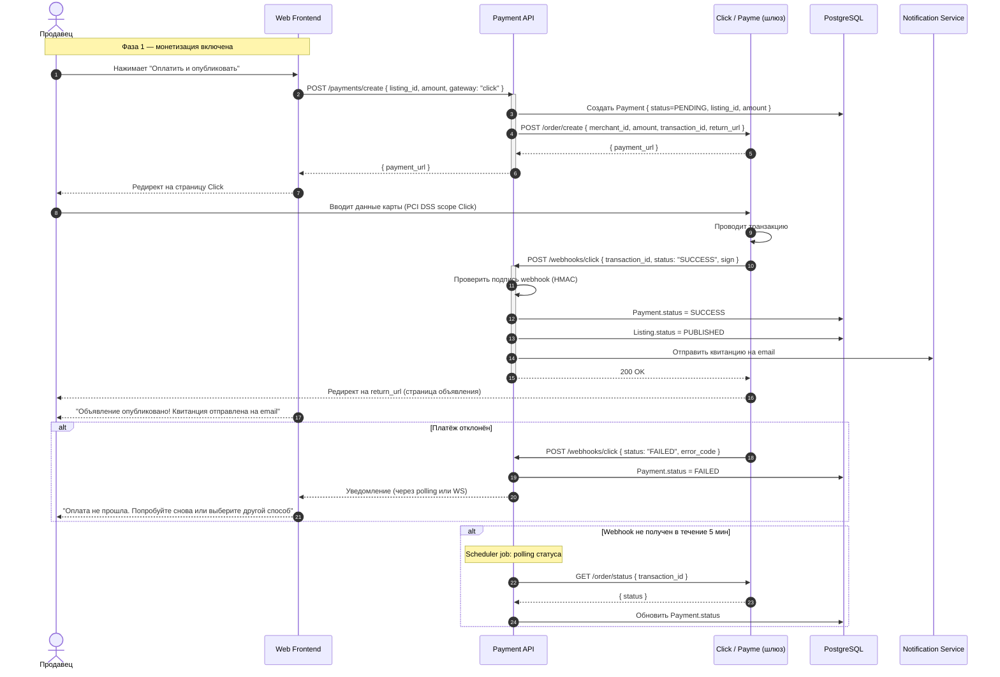
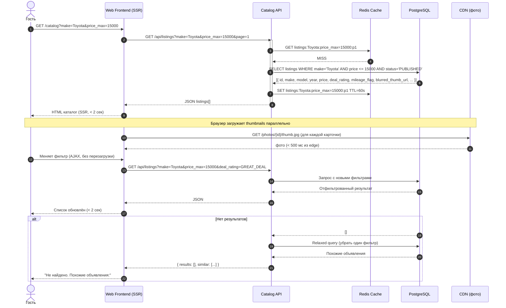

# Carsale — Sequence-диаграммы

> Версия: 1.0 · Дата: 2026-06-28 · Источник: [PRD](../PRD.md) · Автор: Системный аналитик

Диаграммы покрывают P0 use cases: happy path и значимые ошибочные сценарии.  
Участники согласованы с контейнерами из [09-architecture.md](09-architecture.md).

---

## 6.1 Регистрация через SMS OTP (UC-03)

Сценарий: новый пользователь вводит номер телефона и подтверждает OTP.

**Участники:** Web Frontend (React/Next.js) → Auth API (Node.js) → PostgreSQL → Eskiz UZ (внешний)  
**Допущение:** JWT access token — short-lived (15 мин), refresh token — long-lived (30 дней), хранится в HttpOnly cookie.

---

## 6.2 Размещение объявления (UC-08) — happy path

Сценарий: аутентифицированный продавец заполняет форму, загружает фото, получает Deal Rating, публикует.

**Участники:** Web Frontend → Listing API → ML Service (sync для blur и deal-rating; async для fraud) → PostgreSQL → CDN → Queue → Notification Service  
**Допущение:** Блюр и Deal Rating — синхронные вызовы (пользователь ждёт). Fraud check — асинхронный (через очередь), чтобы не блокировать UI.

---

## 6.3 Размещение с фрод-флагом (UC-08, ошибочный путь)

Сценарий: объявление задетектировано как фрод (дубль фото) — скрывается, уходит на модерацию.

---

## 6.4 Чат продавец ↔ покупатель (UC-06)

Сценарий: покупатель инициирует чат, продавец отвечает.

---

## 6.5 Оплата за публикацию объявления (UC-11)

Сценарий: продавец оплачивает размещение через Click.

---

## 6.6 Просмотр каталога с Deal Rating (UC-01)

Сценарий: гость открывает каталог, применяет фильтры.

