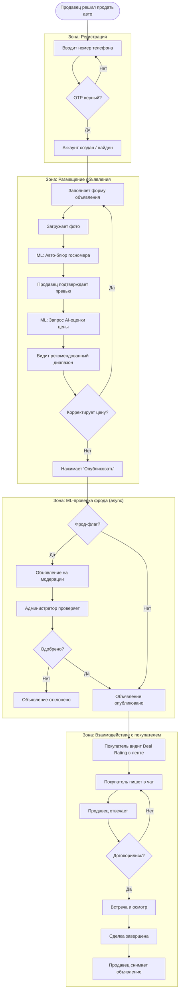
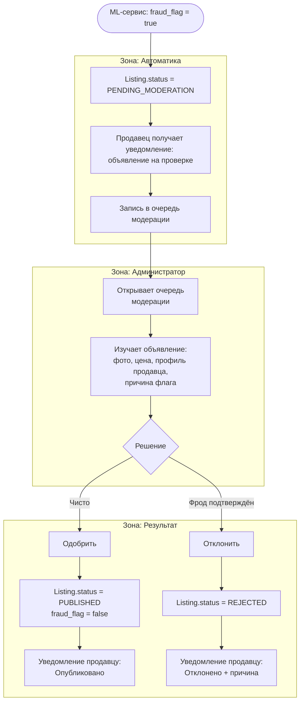
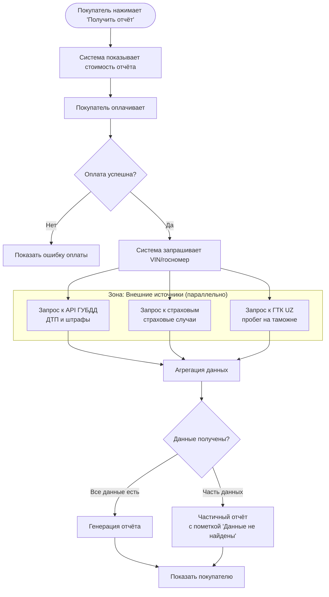
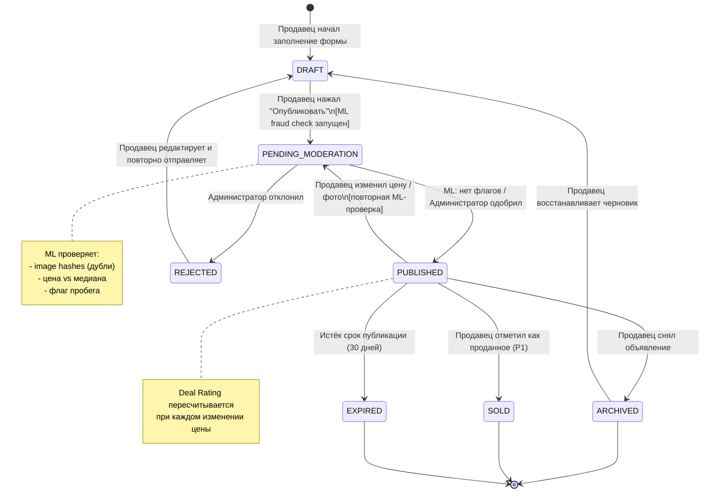
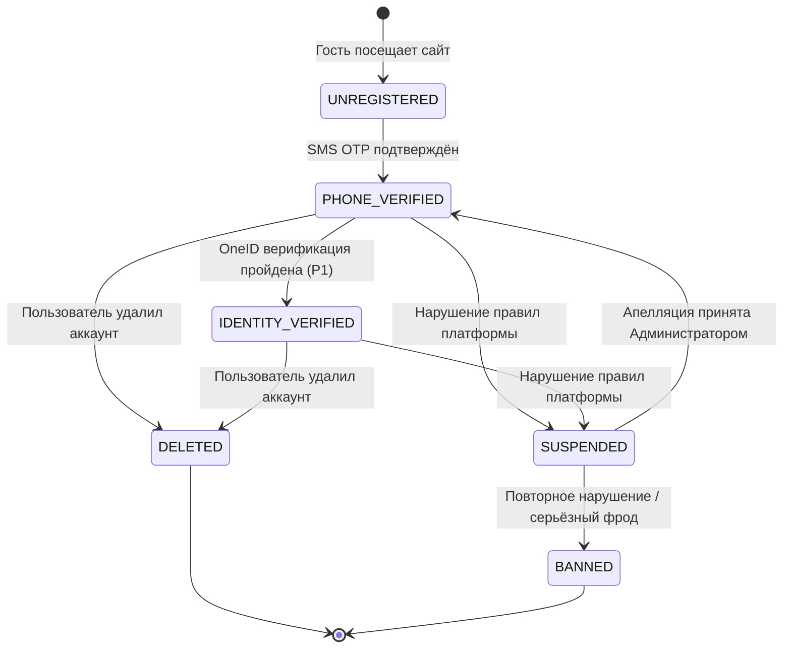
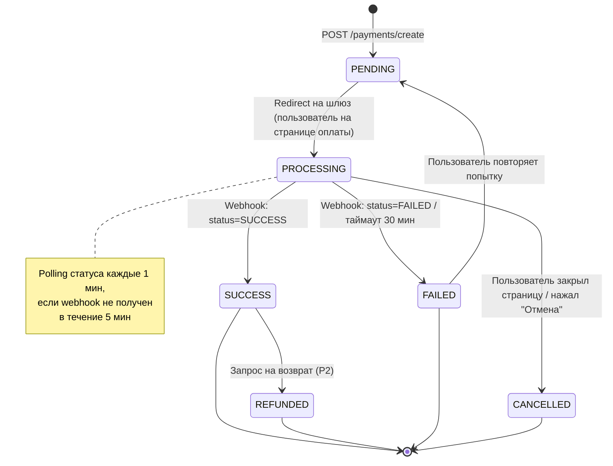
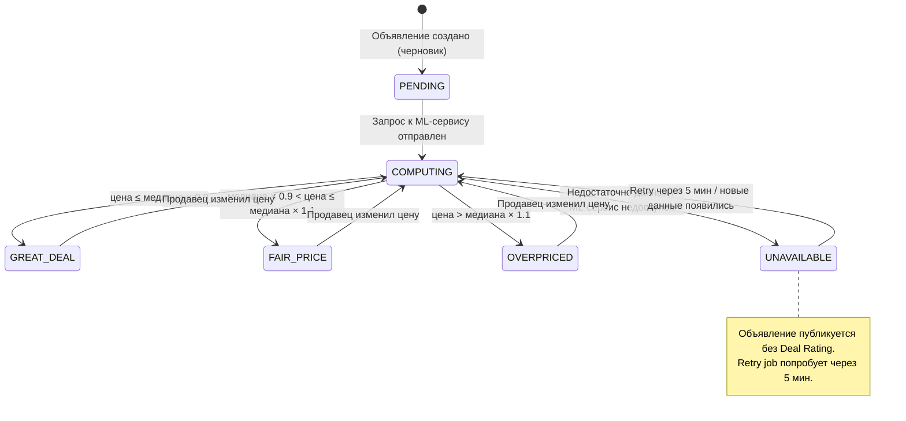

# Carsale — Процессы и жизненные циклы сущностей

> Версия: 1.0 · Дата: 2026-06-28 · Источник: [PRD](../PRD.md) · Автор: Системный аналитик

---

## 1. Бизнес-процессы (Activity-диаграммы)

### 1.1 Сквозной процесс: Продажа автомобиля на платформе

Полный путь от регистрации продавца до завершения сделки.

---

### 1.2 Процесс модерации фрод-флага

Административный процесс проверки помеченных объявлений.

---

### 1.3 Процесс получения расширенного отчёта (P1)

---

## 2. Жизненные циклы сущностей (State Machine)

### 2.1 Жизненный цикл Объявления (Listing)

Состояния согласованы с полем `status` в модели данных ([08-data-model.md](08-data-model.md)).

**Описание переходов:**

| Из | В | Триггер | Условие |
|----|---|---------|---------|
| `[*]` | DRAFT | Продавец открыл форму | Аутентифицирован |
| DRAFT | PENDING_MODERATION | POST /listings/{id}/publish | Обязательные поля заполнены, ≥ 1 фото |
| PENDING_MODERATION | PUBLISHED | ML: нет флагов ИЛИ Admin: одобрил | fraud_flag = false |
| PENDING_MODERATION | REJECTED | Admin: отклонил | fraud_flag = true, подтверждён |
| PUBLISHED | PENDING_MODERATION | PUT /listings/{id} (цена/фото) | Повторная проверка ML |
| PUBLISHED | ARCHIVED | DELETE /listings/{id} | Продавец владелец |
| PUBLISHED | EXPIRED | Cron job (ежедневно) | created_at + 30 дней < now() |
| REJECTED | DRAFT | PUT /listings/{id}/edit | Продавец исправил объявление |

---

### 2.2 Жизненный цикл Пользователя (User)

---

### 2.3 Жизненный цикл Платежа (Payment)

---

### 2.4 Жизненный цикл Deal Rating

