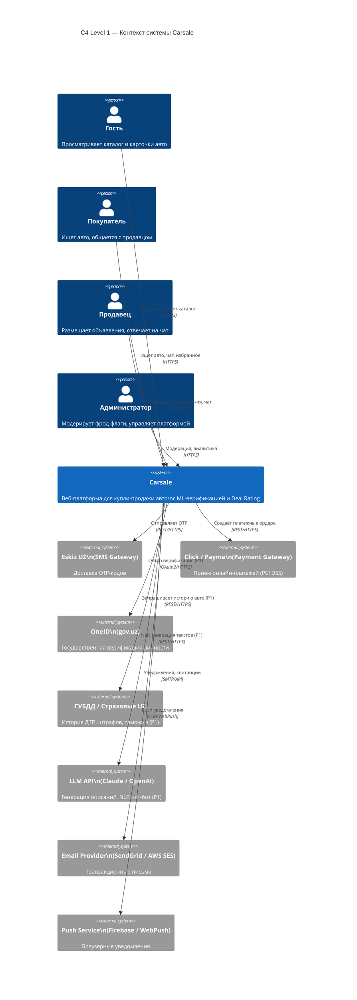
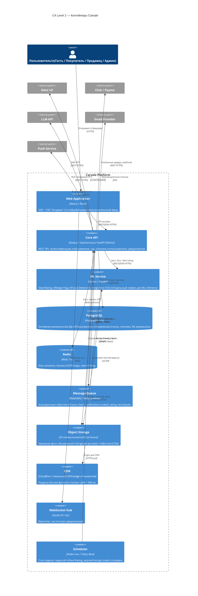
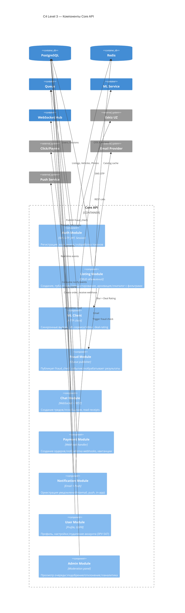
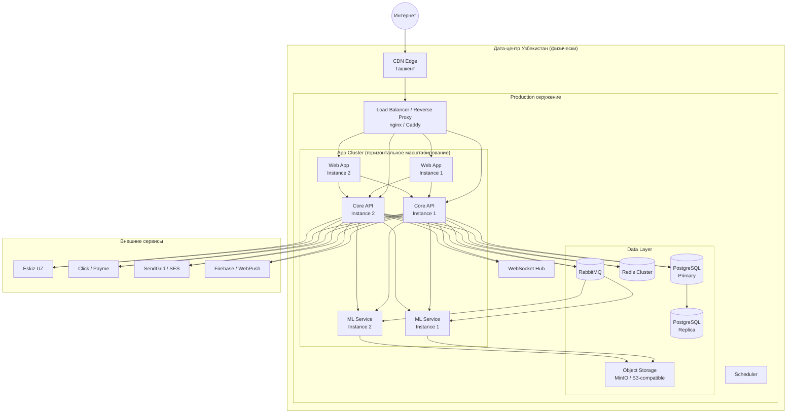

# Carsale — Архитектура системы (C4 + arc42)

> Версия: 1.0 · Дата: 2026-06-28 · Источник: [PRD](../PRD.md) · Автор: Системный аналитик  
> Стандарт: C4 model + arc42 (облегчённый)

---

## 1. Цели и ограничения архитектуры

### Качественные атрибуты (из NFR)

| Атрибут | Требование | Документ |
|---------|-----------|---------|
| Производительность | Каталог p95 < 2 сек; ML inference < 1 сек; блюр < 5 сек | NFR-1, 2, 3 |
| Доступность | Uptime ≥ 99.5%; RTO ≤ 30 мин | NFR-10 |
| Масштабируемость | Горизонтальное масштабирование каталога и ML | NFR-7 |
| Безопасность | TLS 1.2+; AES-256; rate limiting; OWASP Top 10 | NFR-12, 13, 14, 16 |
| Соответствие | ЗРУ-547: PII только в юрисдикции UZ | NFR-18 |
| Локализация | UZ + RU; CDN в Узбекистане | NFR-8, 28 |

### Ключевые ограничения

- **Хостинг:** физически в Узбекистане (ЗРУ-547, ст. 8) — ADR-004
- **Платформа:** только веб (не мобильное приложение) в MVP — ADR-005
- **Архитектурный стиль:** модульный монолит на старте → микросервисы при необходимости — ADR-006
- **ML:** Python-сервисы, отдельно от основного бэкенда
- **PCI DSS:** данные карт только через шлюз — NFR-17, BR-6

---

## 2. Контекст системы (C4 Level 1)

Система Carsale в окружении пользователей и внешних систем.

---

## 3. Контейнеры (C4 Level 2)

Внутренняя структура Carsale: контейнеры (отдельно запускаемые единицы).

### Таблица контейнеров

| Контейнер | Технология | Ответственность |
|-----------|-----------|----------------|
| Web Application | Next.js 14+ (React) | SSR для SEO каталога; CSR для чата и форм; i18n (UZ/RU) |
| Core API | Node.js + Express (или Python FastAPI) | Вся бизнес-логика кроме ML; REST endpoints; JWT auth |
| ML Service | Python + FastAPI | Deal Rating (XGBoost/LightGBM); Blur (OpenCV/YOLO); Fraud (hash + rules) |
| PostgreSQL | PostgreSQL 15+ | Персистентное хранение всех бизнес-данных |
| Redis | Redis 7+ | Кэш каталога (TTL 60 сек); OTP (TTL 5 мин); сессии; rate limits |
| Message Queue | RabbitMQ или Redis Streams | Декуплинг: async fraud check, уведомления, фоновые задачи |
| Object Storage | S3-совместимое (MinIO или облако UZ) | Фото (оригинал private + blurred public) |
| CDN | Cloudflare / Local CDN | Edge-раздача фото; статика Web App |
| WebSocket Hub | Socket.IO | Real-time чат и push в браузере |
| Scheduler | node-cron / Celery Beat | EXPIRED listings; deal_rating retry; price alert jobs |

---

## 4. Компоненты Core API (C4 Level 3)

Декомпозиция наиболее критичного контейнера.

---

## 5. Сквозные концепции (cross-cutting)

### Аутентификация и авторизация
- **AuthN:** JWT (access token 15 мин + refresh token 30 дней в HttpOnly cookie)
- **AuthZ:** RBAC на уровне API middleware; роли: GUEST / BUYER / SELLER / ADMIN
- **Сессии:** refresh token в Redis (можно инвалидировать при logout)

### Обработка ошибок
- Все ошибки возвращаются в формате `{ error: string, code: string, details?: object }`
- HTTP статусы: 400 (validation), 401 (unauth), 403 (forbidden), 404 (not found), 429 (rate limit), 503 (dependency unavailable)
- Ошибки внешних сервисов (Eskiz, LLM) — graceful degradation, не 500

### Логирование и observability
- Структурированные JSON-логи (Winston / structlog); уровни: ERROR/WARN/INFO/DEBUG
- Trace ID сквозной через все сервисы (X-Request-ID header)
- Метрики в Prometheus → Grafana: RPS, latency p50/p95/p99, error rate, queue depth

### Транзакции
- Бизнес-транзакции в PostgreSQL (ACID); queue events — at-least-once delivery
- Идемпотентные webhook handlers (payment, fraud) — проверка по `gateway_transaction_id`

### Конфигурация
- Секреты в environment variables / Vault; не в коде и не в репозитории
- Feature flags: монетизация (FR-14) включается конфигом без деплоя

---

## 6. Развёртывание (deployment, высокий уровень)

**Окружения:**

| Окружение | Назначение |
|-----------|-----------|
| `local` | Разработка; docker-compose с PostgreSQL, Redis, MinIO |
| `staging` | Интеграционное тестирование; полная копия prod без CDN |
| `production` | Боевая; UZ дата-центр; горизонтальное масштабирование |

---

## 7. Архитектурные решения (ADR)

Полные тексты ADR — в директории [14-adr/](14-adr/).

| ADR | Решение | Статус |
|-----|---------|--------|
| [ADR-001](14-adr/ADR-001-sms-gateway.md) | SMS-шлюз: Eskiz UZ | Принято |
| [ADR-002](14-adr/ADR-002-payment-gateway.md) | Платёжный шлюз: Click + Payme | Принято |
| [ADR-003](14-adr/ADR-003-ml-seed-dataset.md) | Стратегия ML seed-датасета: синтетическая генерация | Принято |
| [ADR-004](14-adr/ADR-004-uz-hosting.md) | Хостинг только в юрисдикции UZ (ЗРУ-547) | Принято |
| [ADR-005](14-adr/ADR-005-web-first.md) | Web-first архитектура: нет мобильного приложения в MVP | Принято |
| [ADR-006](14-adr/ADR-006-modular-monolith.md) | Модульный монолит как стартовая архитектура | Принято |
