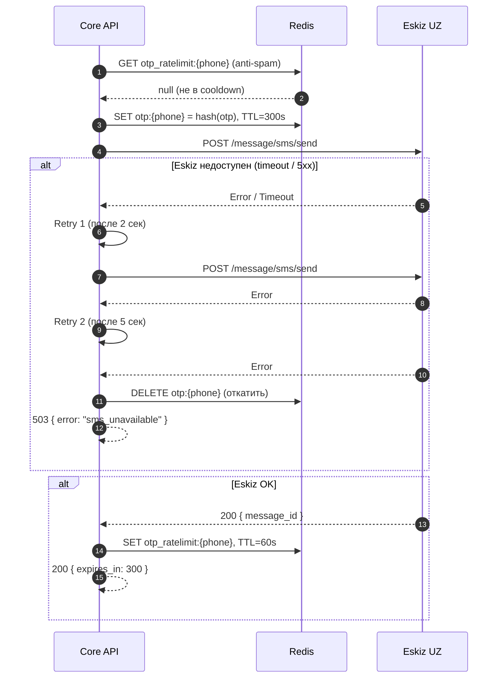
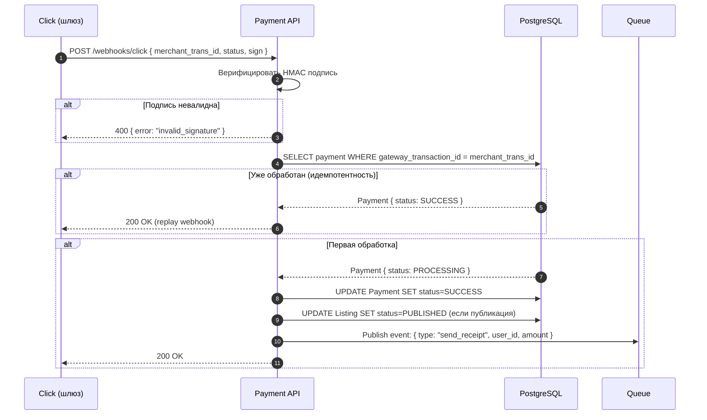

# Carsale — Интеграции и API-контракты

> Версия: 1.0 · Дата: 2026-06-28 · Источник: [PRD](../PRD.md) · Автор: Системный аналитик

---

## 1. Карта интеграций

| # | Внешняя система | Назначение | Протокол | Направление | Критичность | Фаза | Владелец контракта |
|---|----------------|-----------|----------|-------------|-------------|------|--------------------|
| I-1 | **Eskiz UZ** (SMS) | Доставка OTP для регистрации/входа | REST/HTTPS | Carsale → Eskiz | Критическая | P0 | Eskiz UZ |
| I-2 | **Click** (Платёж) | Приём оплаты за публикацию и отчёты | REST/HTTPS + Webhook | Carsale ↔ Click | Критическая | P0 | Click Uzbekistan |
| I-3 | **Payme** (Платёж) | Альтернативный платёжный шлюз | REST/HTTPS + Webhook | Carsale ↔ Payme | Высокая | P0 | Payme |
| I-4 | **SendGrid / AWS SES** (Email) | Транзакционные письма, квитанции, алерты | REST API / SMTP | Carsale → Provider | Средняя | P0 | SendGrid / AWS |
| I-5 | **Firebase / WebPush** (Push) | Браузерные push-уведомления | FCM REST / WebPush API | Carsale → Push | Средняя | P0 | Google / IETF |
| I-6 | **CDN** (Cloudflare / Local) | Раздача blurred-фото и статики | HTTPS pull | CDN → Object Storage | Высокая | P0 | Cloudflare / UZ CDN |
| I-7 | **OneID** (gov.uz) | OAuth-верификация личности продавца | OAuth 2.0 / HTTPS | Carsale ↔ OneID | Высокая | P1 | gov.uz (OneID) |
| I-8 | **ГУБДД УДД** | История ДТП, штрафы по VIN/госномеру | REST/HTTPS или B2G-формат | Carsale → ГУБДД | Высокая | P1 | ГУБДД МВД РУз |
| I-9 | **Страховые компании UZ** | Страховые случаи по авто | REST/HTTPS | Carsale → Страховая | Средняя | P1 | TBD (партнёрство) |
| I-10 | **ГТК UZ** (Таможня) | Пробег авто на момент растаможки | REST/HTTPS или B2G | Carsale → ГТК | Средняя | P1 | ГТК РУз |
| I-11 | **LLM API** (Claude / OpenAI) | Генерация описаний, перевод, чат-бот, NLP | REST/HTTPS | Carsale → LLM | Средняя | P1 | Anthropic / OpenAI |

---

## 2. Контракты API (высокий уровень)

### 2.1 Eskiz UZ — Отправка SMS OTP (I-1)

**Запрос (Carsale → Eskiz):**
```
POST https://notify.eskiz.uz/api/message/sms/send
Authorization: Bearer {API_TOKEN}
Content-Type: application/json

{
  "mobile_phone": "998901234567",
  "message": "Carsale: Ваш код подтверждения: 123456. Не сообщайте никому.",
  "from": "4546",
  "callback_url": "https://carsale.uz/webhooks/eskiz-delivery"
}
```

**Ответ (успех):**
```json
{
  "id": "msg_abc123",
  "status": "waiting",
  "message": "Waiting for send"
}
```

**Обработка ошибок:**
- `401` — истёк API token → обновить token, retry
- `422` — неверный формат номера → вернуть ошибку пользователю
- `429` — rate limit → retry через 60 сек с exponential backoff
- Timeout 5 сек → 503 пользователю «SMS сервис недоступен»

**Идемпотентность:** OTP-запись в Redis по номеру телефона; повторный запрос на тот же номер в течение 60 сек отклоняется (anti-spam).

---

### 2.2 Click — Создание платёжного ордера (I-2)

**Запрос (Carsale → Click):**
```
POST https://api.click.uz/v2/merchant/invoice/create
Authorization: {TOKEN}
Content-Type: application/json

{
  "service_id": "{CARSALE_SERVICE_ID}",
  "amount": 50000,
  "currency": "UZS",
  "transaction_id": "pay_uuid_abc123",
  "description": "Публикация объявления #listing_id",
  "return_url": "https://carsale.uz/payment/return?tx=pay_uuid_abc123",
  "expire_time": 1800
}
```

**Ответ:**
```json
{
  "error": 0,
  "payment_url": "https://my.click.uz/services/pay?service_id=...&merchant_trans_id=..."
}
```

**Webhook (Click → Carsale):**
```
POST https://carsale.uz/webhooks/click
Content-Type: application/json

{
  "click_trans_id": 123456789,
  "service_id": "{CARSALE_SERVICE_ID}",
  "merchant_trans_id": "pay_uuid_abc123",
  "amount": 50000,
  "action": 1,
  "sign_time": "2026-06-28 10:00:00",
  "sign_string": "md5_signature"
}
```

**Обработка webhook:**
1. Проверить HMAC подпись (`sign_string = md5(click_trans_id + service_id + SECRET_KEY + merchant_trans_id + amount + action + sign_time)`)
2. Найти Payment по `merchant_trans_id`
3. Проверить идемпотентность (уже обработан? → 200 OK)
4. Если `action=1` (оплата) и подпись верна → Payment.status = SUCCESS
5. Триггер: публикация объявления или возврат отчёта

**Ошибки:** `action=-1` → отмена; `action=0` → проверка (prepare phase).

---

### 2.3 Click — Проверка статуса (polling fallback, I-2)

```
GET https://api.click.uz/v2/merchant/payment/status/{transaction_id}
Authorization: {TOKEN}
```

Используется Scheduler job, если webhook не получен в течение 5 мин.

---

### 2.4 ML Service — Внутренний API

ML Service — внутренний контейнер. API для Core API:

**Deal Rating:**
```
POST http://ml-service/v1/deal-rating
Content-Type: application/json

{
  "make": "Toyota",
  "model": "Camry",
  "year": 2018,
  "mileage": 85000,
  "condition": "GOOD",
  "city": "Tashkent",
  "price_uzs": 125000000
}
```
Ответ:
```json
{
  "label": "FAIR_PRICE",
  "score": 0.87,
  "recommended_min_uzs": 118000000,
  "recommended_max_uzs": 132000000,
  "computed_at": "2026-06-28T10:00:00Z"
}
```
SLA: p95 < 1 000 мс. Timeout Core API: 1 500 мс. При таймауте → Deal Rating = UNAVAILABLE.

**Image Blur:**
```
POST http://ml-service/v1/blur
Content-Type: multipart/form-data

file: {photo_binary}
```
Ответ:
```json
{
  "blurred_key": "photos/blurred/abc123.jpg",
  "original_key": "photos/originals/abc123.jpg",
  "plate_detected": true,
  "processing_time_ms": 2300
}
```
SLA: p95 < 5 000 мс. Если CV-модель не обнаружила номер — `plate_detected: false`, продавец может отметить вручную.

**Fraud Check (async через Queue):**
```json
Queue message: {
  "action": "fraud_check",
  "listing_id": "uuid",
  "photo_hashes": ["hash1", "hash2"],
  "price_uzs": 125000000,
  "market_median_uzs": 125000000
}
```
ML Service публикует результат обратно в Queue.

---

### 2.5 OneID — OAuth 2.0 верификация (I-7, P1)

```
GET https://oneid.uz/oauth/authorize
  ?client_id={CARSALE_CLIENT_ID}
  &redirect_uri=https://carsale.uz/auth/oneid/callback
  &response_type=code
  &scope=name,passport_number,birthdate
  &state={csrf_token}
```

**Callback:**
```
GET https://carsale.uz/auth/oneid/callback?code={AUTH_CODE}&state={csrf_token}
```

**Token exchange:**
```
POST https://oneid.uz/oauth/token
{ grant_type: "authorization_code", code, redirect_uri, client_id, client_secret }
```

**Результат:** профиль пользователя (имя, дата рождения, статус паспорта) → Carsale устанавливает `verification_status = IDENTITY_VERIFIED`.

**Биометрия:** если OneID использует фото лица → отдельное согласие (NFR-20).

---

### 2.6 LLM API — Генерация описания (I-11, P1)

**Важно:** PII НЕ передаётся (BR-8, NFR-22).

```
POST https://api.anthropic.com/v1/messages
Authorization: x-api-key {API_KEY}
anthropic-version: 2023-06-01

{
  "model": "claude-sonnet-4-6",
  "max_tokens": 500,
  "messages": [{
    "role": "user",
    "content": "Напиши продающее описание для объявления о продаже автомобиля на русском языке.\nМарка: Toyota, Модель: Camry, Год: 2018, Пробег: 85000 км, Состояние: хорошее, КПП: автомат, Двигатель: 2.5л.\nОписание должно быть 3-4 предложения, без выдумок, честное."
  }]
}
```

**Обработка:** ответ LLM → предзаполняет поле описания; продавец редактирует.  
**Fallback:** если LLM API недоступен → поле описания пустое, продавец заполняет вручную.  
**Таймаут:** 10 сек; если превышен → graceful degradation.

---

## 3. Sequence интеграционных сценариев

### 3.1 SMS OTP с обработкой недоступности Eskiz UZ



### 3.2 Webhook-обработка платежа Click (с идемпотентностью)


