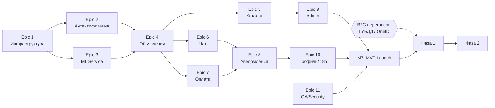
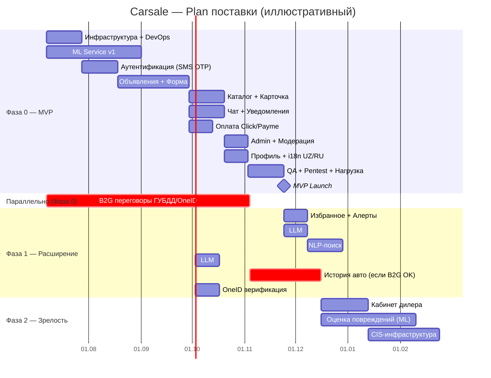

# Carsale — План поставки

> Версия: 1.0 · Дата: 2026-06-28 · Источник: [PRD](../PRD.md) · Автор: Системный аналитик  
> ⚠ Оценки — **T-shirt sizing**, иллюстративны. Не являются обязательством по датам.

---

## 1. Декомпозиция работ (WBS)

### Epic 1 — Инфраструктура и DevOps (Sprint 0)
- 1.1 Настройка CI/CD pipeline (GitHub Actions / GitLab CI)
- 1.2 Docker-compose для local dev (PostgreSQL, Redis, RabbitMQ, MinIO)
- 1.3 Staging и Production окружения (UZ-хостинг)
- 1.4 Object Storage + CDN конфигурация
- 1.5 Observability: Prometheus + Grafana + ELK/Loki
- 1.6 Секреты: Vault / env-management
- **Оценка:** L (3–4 нед.) · **Требования:** NFR-10, 12, 25, 26

### Epic 2 — Аутентификация и верификация (Sprint 1–2)
- 2.1 База данных: схема USER, миграции
- 2.2 SMS OTP flow (FR-01): интеграция Eskiz UZ
- 2.3 JWT auth middleware (access + refresh token)
- 2.4 Rate limiting (NFR-14)
- 2.5 Базовый UI: страница входа, форма OTP
- **Оценка:** M (2–3 нед.) · **Требования:** FR-01, NFR-12, 15

### Epic 3 — ML-сервис v1 (Sprint 1–3, параллельно)
- 3.1 Сбор и синтетическая генерация seed-датасета для Deal Rating
- 3.2 Обучение Deal Rating модели (LightGBM/XGBoost)
- 3.3 CV-модель блюра госномера (YOLO fine-tune или OpenCV)
- 3.4 Image hash для детекции дублей
- 3.5 Ценовая аномалия (rule-based: порог 40%)
- 3.6 FastAPI ML-сервис с endpoint'ами: /deal-rating, /blur, /fraud-check
- 3.7 Интеграционные тесты ML API
- **Оценка:** XL (6–8 нед.) · **Требования:** FR-03, 09, 10, 11

### Epic 4 — Объявления (Sprint 2–4)
- 4.1 Схема LISTING, VEHICLE, PHOTO, ML_RESULT
- 4.2 CRUD объявлений (черновик, публикация, редактирование, снятие)
- 4.3 Форма размещения (фронтенд): step-by-step wizard
- 4.4 Загрузка фото + превью блюра (интеграция с ML-сервисом)
- 4.5 Deal Rating виджет: запрос оценки, отображение диапазона
- 4.6 Публикация: асинхронная fraud-проверка через Queue
- 4.7 Жизненный цикл объявления: статусы, EXPIRED cron job
- **Оценка:** XL (6–8 нед.) · **Требования:** FR-03, 04, 05, 09, 10, 11

### Epic 5 — Каталог и поиск (Sprint 3–4)
- 5.1 API каталога: фильтры, сортировка, пагинация
- 5.2 Redis кэш каталога (TTL 60 сек)
- 5.3 Страница каталога (SSR, Next.js): карточки с Deal Rating
- 5.4 Страница объявления: галерея, ML-флаги, кнопка «Написать»
- 5.5 Фильтрация без перезагрузки (AJAX / React state)
- 5.6 «Похожие объявления» (fallback при нулевых результатах)
- **Оценка:** L (3–4 нед.) · **Требования:** FR-06, 07

### Epic 6 — Чат (Sprint 4–5)
- 6.1 Схема CHAT_THREAD, MESSAGE
- 6.2 REST API чата (create thread, send message, list threads)
- 6.3 WebSocket Hub (Socket.IO): real-time доставка
- 6.4 UI чата: inbox продавца, диалог покупателя
- 6.5 Email/Push уведомление о новом сообщении
- **Оценка:** L (3–4 нед.) · **Требования:** FR-12, 13

### Epic 7 — Оплата (Sprint 5)
- 7.1 Схема PAYMENT
- 7.2 Интеграция Click (create order, webhook handler)
- 7.3 Интеграция Payme (опционально, параллельно или Sprint 6)
- 7.4 UI оплаты: выбор шлюза, redirect, return page
- 7.5 Квитанция на email
- 7.6 Idempotency + polling fallback (webhook retry)
- **Оценка:** M (2–3 нед.) · **Требования:** FR-14, NFR-17

### Epic 8 — Уведомления (Sprint 4–5, параллельно с чатом)
- 8.1 Notification Service: queue consumer
- 8.2 Email уведомления (SendGrid/SES): статус объявления, чат, квитанции
- 8.3 Web Push уведомления (Firebase)
- 8.4 Настройки уведомлений в профиле
- **Оценка:** M (2 нед.) · **Требования:** FR-13

### Epic 9 — Модерация и Admin-панель (Sprint 5)
- 9.1 Admin UI: очередь модерации фрод-флагов
- 9.2 Approve / Reject объявления с комментарием
- 9.3 Управление пользователями (suspend/ban)
- 9.4 Базовая аналитика: объявления, пользователи, MAU
- **Оценка:** M (2–3 нед.) · **Требования:** FR-15 (UC-15), UC-16, UC-17

### Epic 10 — Профиль, GDPR и i18n (Sprint 5–6)
- 10.1 Профиль пользователя: редактирование, настройки
- 10.2 Удаление аккаунта (ЗРУ-547): soft delete + data anonymization
- 10.3 i18n framework: UZ/RU ключи, переключатель в шапке
- 10.4 Политика конфиденциальности и форма согласия
- **Оценка:** M (2–3 нед.) · **Требования:** NFR-18–21, 28

### Epic 11 — MVP QA и Security (Sprint 6)
- 11.1 E2E тесты (Playwright): P0 user flows (каталог, регистрация, размещение, чат, оплата)
- 11.2 Нагрузочный тест (k6): 10K concurrent sessions
- 11.3 Pentest (OWASP Top 10)
- 11.4 SSL/TLS конфигурация (A+ на SSL Labs)
- 11.5 Backup & Restore drill
- **Оценка:** L (3 нед.) · **Требования:** NFR-1, 10, 12, 16

---

## 2. Фазы и майлстоуны

### Фаза 0 — MVP «Доверенный маркетплейс»

**Цель:** Запустить рабочую платформу с Deal Rating и ML-верификацией в каждом объявлении.

| Майлстоун | Что включает | Критерий готовности |
|-----------|-------------|---------------------|
| **M0: Sprint 0** | Инфраструктура, dev-environment, CI/CD | Staging развёрнут; pipeline зелёный |
| **M1: Auth Alpha** | SMS OTP регистрация/вход | OTP ≤ 30 сек; JWT работает |
| **M2: ML v1** | Deal Rating, блюр, fraud detection | MAPE ≤ 15%; ≥ 95% блюра; hash detection |
| **M3: Listings Beta** | Форма размещения, Deal Rating UI, публикация | Объявление проходит полный цикл |
| **M4: Catalog + Card** | Каталог, карточка, ML-флаги | Фильтры ≤ 2 сек; флаги на карточке |
| **M5: Chat + Payments** | Чат, уведомления, оплата (инфраструктура) | Real-time сообщения; webhook Click |
| **M6: Admin + Moderation** | Панель модерации, профиль, i18n UZ/RU | Очередь модерации работает |
| **M7: MVP Launch** | QA, pentest, нагрузочный тест, prod-деплой | Все P0 acceptance criteria зелёные |

**Длительность Фазы 0:** ~14–18 недель (3.5–4.5 месяца)

---

### Фаза 1 — Расширение «История + Retention»

**Цель:** История авто как premium-фича; инструменты удержания.

| Эпик | Оценка |
|------|--------|
| Избранное + сохранённые поиски + алерты цен (FR-16) | M |
| История авто: ГУБДД + страховые + ГТК (FR-15) | XL (B2G зависимость) |
| Рекомендательная система (FR, P1 PRD) | L |
| NLP-поиск (FR-08) | L |
| LLM: авто-описание + перевод RU↔UZ (FR-17) | M |
| LLM: чат-бот на карточке (FR-18) | M |
| OneID верификация (FR-02) | M |

**Длительность Фазы 1:** ~16–20 недель; FR-15 зависит от B2G (критический путь)

---

### Фаза 2 — Зрелость «B2B + Визуальная проверка»

| Эпик | Оценка |
|------|--------|
| Оценка повреждений по фото ML (FR-20) | XL (датасет + модель) |
| Кабинет дилера: массовая загрузка, аналитика (FR-19) | L |
| CIS-инфраструктура: мультирегион, мультивалюта (FR-21) | XL |

**Длительность Фазы 2:** ~16–24 недели

---

## 3. Зависимости

**Критический путь MVP:** E1 → E2 + E3 (параллельно) → E4 → E5, E6, E7 (параллельно) → E9, E10, E11 → M7

**Внешние зависимости:**
- B2G переговоры (ГУБДД, OneID, ГТК) должны начаться **параллельно с Фазой 0** → готовы к Фазе 1
- ML seed-датасет нужен до Sprint ML-1 (за 2 недели до начала ML-обучения)
- Договоры с Eskiz UZ и Click/Payme → до Sprint 1

---

## 4. Грубые оценки по эпикам

| Epic | S/M/L/XL | Нед. (медиана) | Примечание |
|------|----------|----------------|-----------|
| E1 Инфраструктура | L | 3–4 | Блокирует всё |
| E2 Auth | M | 2–3 | Включая Eskiz UZ |
| E3 ML Service | XL | 6–8 | Параллельно с E2; ML-подрядчик или инхаус |
| E4 Объявления | XL | 6–8 | Самый сложный эпик MVP |
| E5 Каталог | L | 3–4 | SSR + кэш |
| E6 Чат | L | 3–4 | WebSocket |
| E7 Оплата | M | 2–3 | Click обязателен; Payme опц. |
| E8 Уведомления | M | 2 | |
| E9 Admin/Mod | M | 2–3 | |
| E10 Профиль/i18n | M | 2–3 | i18n требует перевода всех строк |
| E11 QA/Security | L | 3 | Pentest — внешний подрядчик |
| **ИТОГО MVP** | | **~14–18 нед.** | При команде 3–5 разраб. |

---

## 5. Иллюстративная диаграмма Ганта

Стартовая точка: неделя 1 = дата начала разработки (условно 2026-07-07).  
⚠ Гант иллюстративен — оценки грубые, не обязательство по датам.

